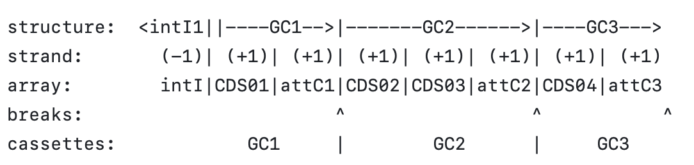

Greetings, integron enthusiasts!!

The function cassetteParser uses the [IntegronFinder](https://doi.org/10.3390/microorganisms10040700) output to identify the cassettes, i.e., coding sequences (CDS) and associated *attC* site.

Given that the bounderies of a cassette are context-driven, this function uses the integrase gene as a reference point and interprets cassettes by separation of the array string by *attC* sites position in the strand complementar to the intI (based on classical integron structure in which the integrase inversely orientated to the gene array), like so:

structure:  <intI1||----GC1-->|-------GC2------>|----GC3--->
strand:       (-1)| (+1)| (+1)| (+1)| (+1)| (+1)| (+1)| (+1)
array:        intI|CDS01|attC1|CDS02|CDS03|attC2|CDS04|attC3
breaks:                       ^                 ^           ^
cassettes:            GC1     |        GC2      |     GC3    

# Cassette parser function

## Arguments required for usage
- **file.path:** path to the annotation file (mandatory).

## Input
If the annotation is provided by another software, the input requires the following columns:
- ID_replicon: the sequence ID;
- ID_integron: different integron structures numbering in the same replicon. Particularly important when we have composite integron structures containing several integrases. IntegronFinder will separate this structure into different arrays (having in consideration the integrase and attC sites orientation) each associated at maximum with 1 integrase;
- element: features identified and numbered by IntegronFinder (essential are the CDS and the *attC* sites);
- pos_beg: sequence position where a feature begins;
- pos_end: sequence position where a feature ends;
- strand: in which strand is encoded a feature.
- annotation: the integrase sequences must be identified with 'intI' (the annotation of other CDS can be later added to the output)

## Warning
In the case of CALIN elements, because there is no integrase detected, this function assumes the integron structures is in the 'correct orientation' (i.e., |----GC1-->|-------GC2------>|----GC3--->).

